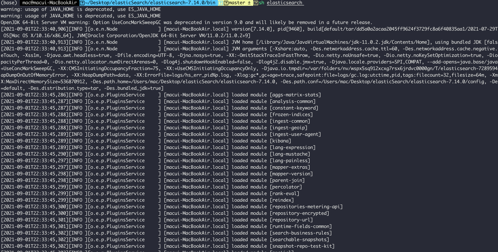
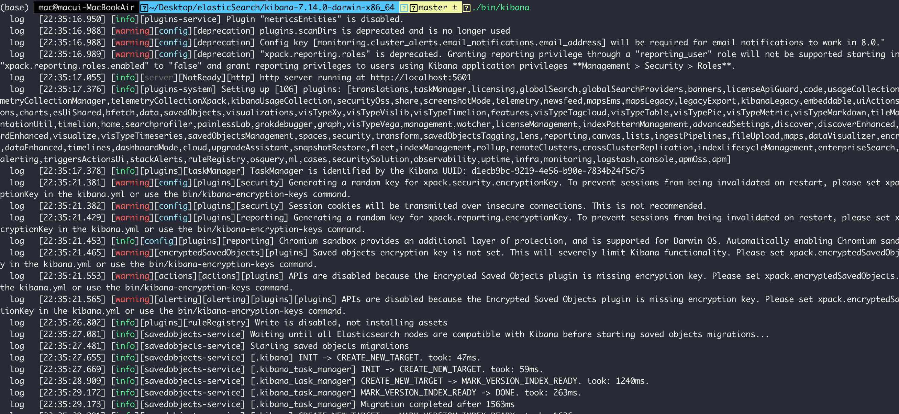
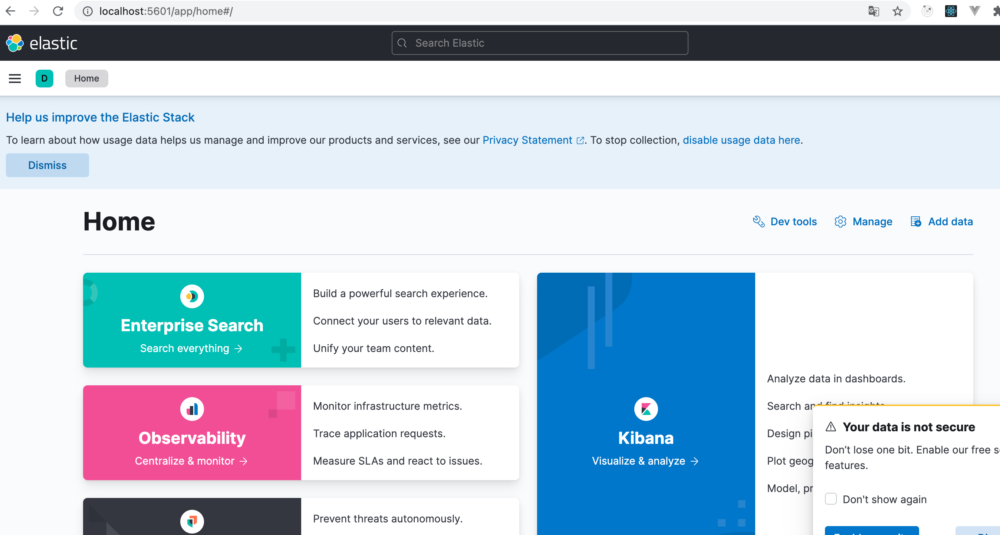
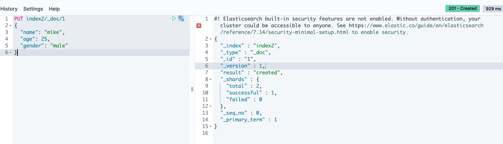
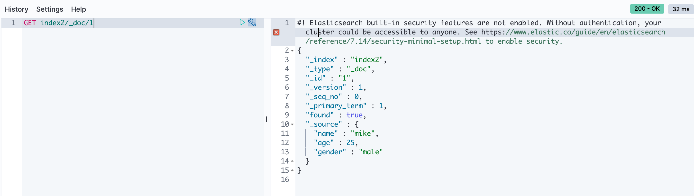
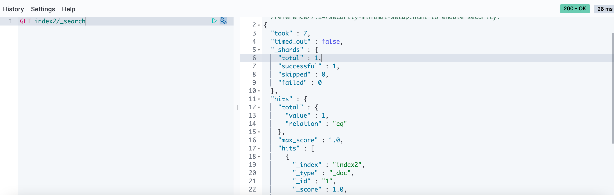
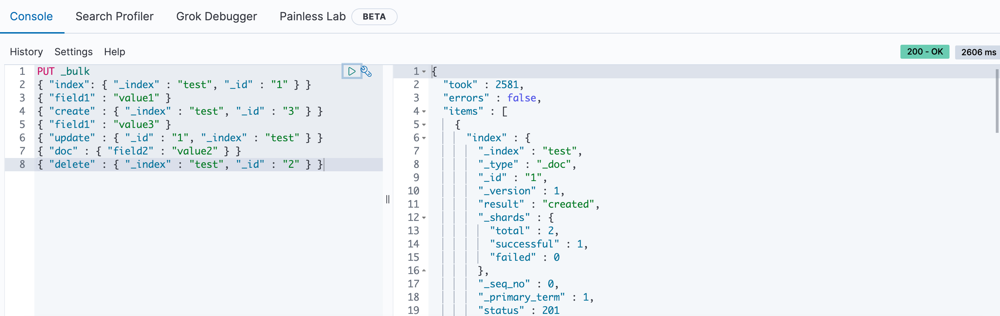
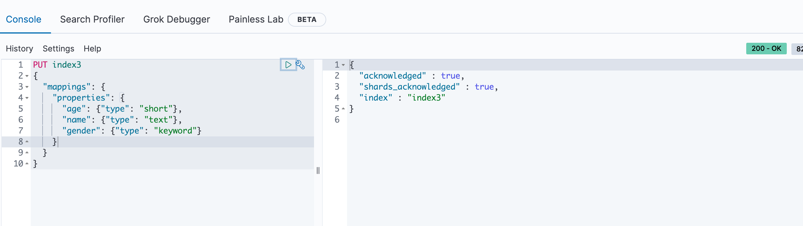
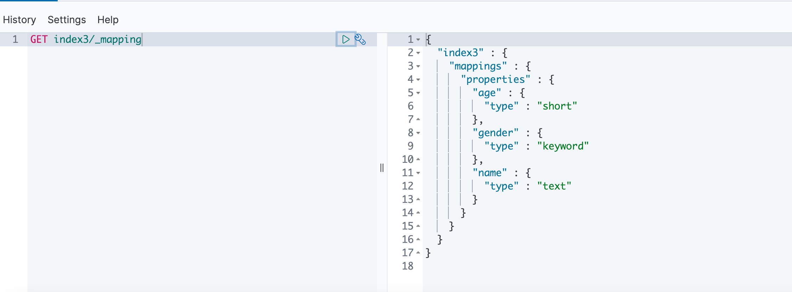

1. 엘라스틱서치와 키바나를 먼저 설치해줍니다.
   





키바나와 엘라스틱서치를 설치하여 실행하게 되면 위에와 같이 로그와 함께 실행이 된다.


- 키바나 홈페이지 들어가기
키바나 홈페이지에 들어갈려면 ```localhost:5601``` 로 접속을 한다.



홈페이지의 DEV Tool 에서 엘라스틱서치를 실행해볼 수 있다.



```
PUT 인덱스명
{
    json키 : value
}
```

RDB 처럼 테이블을 만들 수 있다.
엘라스틱 서치에서는 도큐먼트라고 부른다.



```
GET 인덱스명
```

GET 명령어를 이용하여 도큐먼트를 조회할 수 있다.



search라는 DSL쿼리를 이용해 도큐먼트를 읽어올 수 있다.


- 벌크 데이터
  
데이터 CRUD 동작을 할 때는 REST API를 호출해 하나하나 도큐먼트를 요청하는 것보다 벌크로 한 번에 요청하는게 효율적이다.



JSON 문법처럼 보이지만 복수의 JSON구조를 줄바꿈 문자열로 구분하는 NDJSON형태이다.


- 매핑

엘라스틱 서치에도 데이터베이스의 스키마와 비슷한 역활을 하는것이 있는데 바로 매핑이다.

> 명시적 매핑

인덱스 매핑을 직접 정의하는 것을 명시적 매핑이라고 한다.
인덱스를 생성할 때 mappings 정의를 하거나 properties아래에 필드명과 필드 타입을 지정해주면 된다.



인덱스에서 mapping 구조를 보고 싶으면 밑에와 같이 ```인덱스명/_mapping``` 으로 확인할 수 있다.

